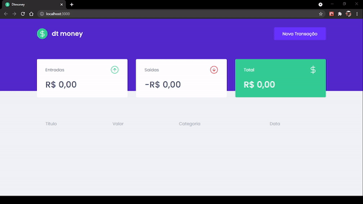
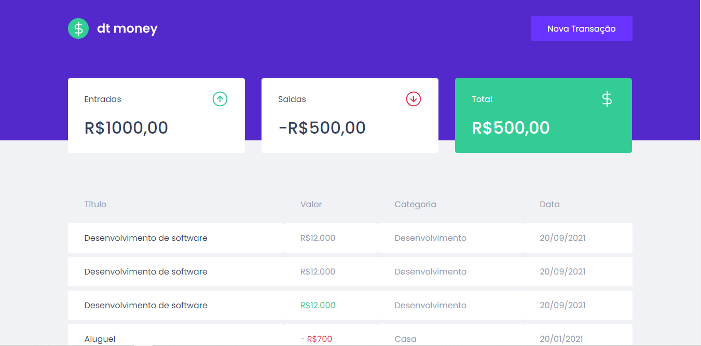
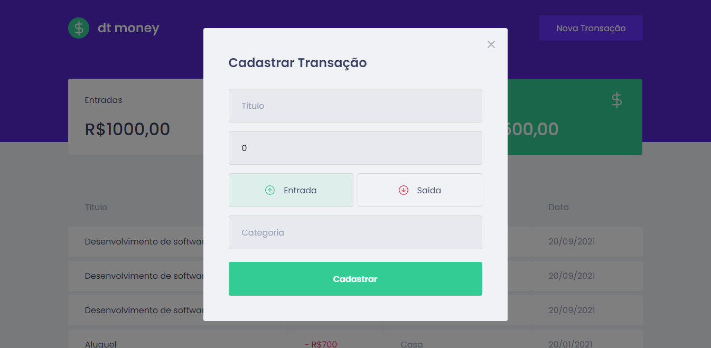

## RocketSeat Primeira Aplição Web em Reactjs Chapter 2

- Nesse Módulo vamos contruir uma aplicação front-end web completa utilizando conceitos e ferramentas importantes do ecossistema React como Styled Components, MirageJs, Context Api, hooks, Axios e muito mais...

### Dentro do <b>README</b> da pasta do projeto está tudo que foi ou está sendo usando:

https://github.com/thiagoadssilva/RocketSeatPrimeiraAplicaoWebReactjsChapter2/blob/main/dtmoney/README.md

## Um pequeno video:

## Algumas imgens:

